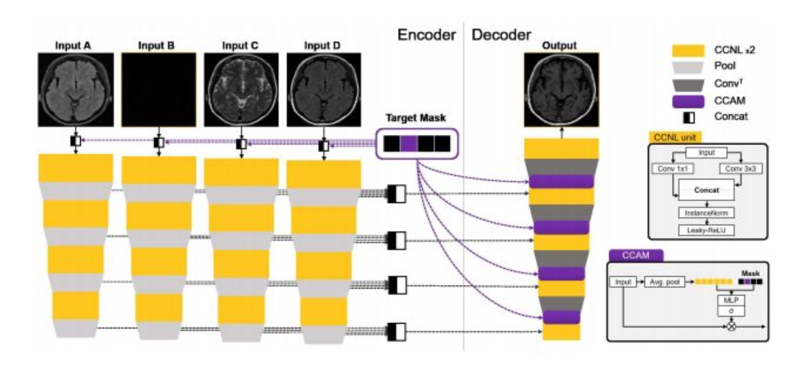

# Brain Image Augmentation using Generative Adversarial Networks (GANs)

Our major objective was to use GANs to create novel images of a brain in a certain domain using the images of the same brain from other domain. In order to perform this style transfer, we used 2 different models:
1. CycleGAN
2. CollaGAN

We will discuss the two in detail now. The code for both are present in the repo.

## CycleGAN: 
[Personal blog link](https://medium.com/@16bit108/cyclegan-brain-image-augmentation-8449f8911f0f) for detailed explanation on CycleGAN.


In CycleGAN, two generators (G and F) and two discriminators ($`D_X`$ and $`D_Y`$) collaborate to perform style transfer between two domains, X and Y. The domain X consists of a stack of images from three modalities, for e.g., T1, T1-Ce, and T2, while Y contains a single target modality, for e.g, FLAIR. We will need to create four such GAN networks for each of the modalities. CollaGAN addresses this issue, which will be discussed later. 

The generators receive X and Y as inputs, producing reconstructed images Y' and X', respectively. These outputs, along with the original images, are passed through the discriminators to optimize the Least Squares Loss (LSLoss). Subsequently, G and F regenerate Y" and X", which are compared with the real images (Y and X) using SSIM Loss and L1 Loss — collectively termed as cyclic consistency loss. This two-step cyclic process ensures that the generators learn to preserve semantic information during style transfer.

The generator architecture leverages CCNR modules — composed of two parallel convolutional blocks with 1x1 and 3x3 kernels. The outputs are concatenated along the channel dimension using appropriate padding, enhancing feature representation while preserving spatial information.

## Losses:

### Generators:
The Generators reduce cycle loss and adversarial loss. The cycle loss is as follows:

  $`cycle\_loss=2*L1(X,X'')+2*L1(Y,Y'')+SSIM(Y,Y'')+SSIM(X,X'')+2(2*L1(X,X')+2*L1(Y,Y')+SSIM(Y,Y')+SSIM(X,X'))`$

  $`adversarial\_loss\_1=LSLoss(D_X(X'),1)`$ (For Generator G)
  
  $`adversarial\_loss\_2=LSLoss(D_Y(Y'),1)`$ (For Generator F)

### Discriminators:
The Discriminators decrease the adversarial loss only.

  (For Discriminator DX)
  $`adversarial\_loss\_1=LSLoss(D_X(X),1)+LSLoss(D_X(X'),0))`$
  
  (For Discriminator DY)
  $`adversarial\_loss\_2=LSLoss(D_Y(Y),1)+LSLoss(D_Y(Y'),0)`$ 

The hyperparameters are specified below:
1. Batch Size = 20
2. Learning Rates:
   1. Generator G: $`10^{-3}`$
   2. Generator F: $`0.5 * 10^{-3}`$
   3. Discriminators: $`10^{-6}`$
3. Number of updates for both networks: 1 per epoch
4. Weights of cycle loss (lambda1 and lambda2): 0.3
5. Ratio of SSIM loss to L1 loss in cycle loss: 1:2
6. Ratio of construction to reconstruction loss (i.e. cycleloss(X’) : cycleloss(X”)): 2:1

While this architecture was successful in creating novel brain images, it required four GAN networks for each of the modalities. This issue was addressed by the use of CollaGAN.

## CollaGAN

This Figure shows the architecture used for the Generator of CollaGAN:



Each input follows an **independent encoding branch**, where the input shape is **(5, 240, 240)** in **channel-first** format, as used in **PyTorch**. The first four channels correspond to inputs **a, b, c,** and **d**, while the fifth channel represents a **one-hot encoded mask**, ensuring that only one channel is active at a time to indicate missing data.

### **Encoder Architecture**
- The encoding path consists of **4 CCNL (Concatenated Convolutional Layers) and Max Pool combinations**.
- Each **CCNL** contains two convolutional layers:  
  - **1x1 filter** for feature transformation.  
  - **3x3 filter** with padding to maintain spatial dimensions.  
- The output undergoes **Instance Normalization** followed by a **Leaky ReLU** activation with a **leak factor of 0.01**.

### **Decoder Architecture**
- The decoder receives the concatenated outputs from all encoding branches.
- It comprises **4 CCNL layers**, **CCAM (Channel-wise Conditional Attention Module)**, and **ConvTranspose** layers.
- **CCAM** adjusts the output by incorporating the mask vector.  
  - Initially, the mask is **one-hot encoded** across the spatial dimensions.
  - The **mean is computed over axes (2,3)**, converting it into a **1D vector** of shape **(batch_size, channel)**.
  - This is concatenated with the **mask vector (batch_size, 4)** and processed through a **Multi-Layer Perceptron (MLP)** with three fully connected layers:
    - Activations: **Leaky ReLU, Leaky ReLU, Sigmoid**.
    - The final output has the same number of neurons as the input channels.
  - The mask-modulated output is **multiplied channel-wise** with the original input.
- **ConvTranspose layers** are used for **learned up-sampling**.
- A final **CCNL layer** refines the **imputed image**.

---

### **Discriminator Architecture**
- The discriminator takes an input of shape **(1, 240, 240)** and processes it through **three parallel paths**, each producing the same number of output channels:
  1. **Path 1**: 4 Convolutional Layers.
  2. **Path 2**: 2 Convolution + MaxPooling layers, followed by Conv + Leaky ReLU.
  3. **Path 3**: 4 Convolutional Layers, with **Leaky ReLU activations** in the 2nd and 3rd layers.
- The outputs from all paths are **concatenated** and passed through the **merge section**, consisting of **two Conv + Leaky ReLU layers**.
- This merged output is then split into **two branches**:
  - **RF (Real/Fake) Branch**:  
    - Uses **two Conv2D layers**.  
    - Final activation: **Sigmoid** (probability of real vs. fake).
  - **Classification Branch**:  
    - Similar structure but with a **Softmax activation** over channels to classify the input into the correct category.

---

### **CollaGAN Pipeline**
1. A **random image type is removed** for each batch.
2. The corresponding **mask is generated** and concatenated with the remaining images.
3. The modified input is passed to the **generator**, producing a **reconstructed image**.
4. The **discriminator evaluates both real and reconstructed images**, generating **two outputs** per image.
5. Using the reconstructed image and the other three original inputs, we generate **four new reconstructions**, each formed by removing a different type and regenerating it with a **mask**.
6. These newly generated images are **fed back into the discriminator**, producing **two outputs per reconstruction**.

### Losses:
1. Least Squares Loss:<br>
   $`L^{dsc}_{gan}(D_{gan})=E_{x_K}[(D_{gan}(x_K)-1)^2] + E_{\hat{x}_{K|K}}[(D_{gan}(\hat{x}_{K|K}))^2]`$<br>
   $`L^{gen}_{gan}(G) = E_{\hat{x}_{K|K}}[(D_{gan}(\hat{x}_{K|K}-1))^2]`$<br>
2. Categorical Cross Entropy:

   $`L^{real}_{clsf}(D_{clsf}) = E_{x_K}[-log(D_{clsf}(K;x_K))]`$
3. L1 and L2 distance loss:

   $`L_{mcc,a} = \|x_b - \bar{x}_{b|a}\|_1 + \|x_c - \bar{x}_{c|a}\|_1 + \|x_d - \bar{x}_{d|a}\|_1`$
5. SSIM loss:

   $`SSIM(p) = \frac{2\mu_X\mu_Y+C_1}{\mu_X^2+\mu_Y^2+C_1}*\frac{\sigma{XY} + C_2}{\sigma_X^2+\sigma_Y^2+C_2}`$

We utilized the [**PyTorch SSIM library**](https://github.com/Po-Hsun-Su/pytorch-ssim), which provides an **inbuilt SSIM loss function**. The library maximizes the SSIM score, where **1** indicates the highest image similarity. However, we adopted a modified version of the **second SSIM formula** to reformulate the objective as a **minimization loss**, making lower values correspond to better performance.

### **Generator Loss Functions**
The generator minimizes multiple loss components to guide the reconstruction process:
- **L2 Distance Loss**: Measures pixel-wise squared differences between:
  - Reconstructed image (recon) and target.
  - Four cyclic reconstructions and their corresponding targets.
  - Four cyclic reconstructions and their respective inputs.

  **Total:** 5 L2 losses  
   
- **L1 Distance Loss**: Similar to L2 but penalizes absolute differences.

  **Total:** 5 L1 losses  

- **SSIM Loss**: Structural Similarity Index between the reconstructed images and their corresponding targets or inputs.

  **Total:** 5 SSIM losses  

- **Least Squares Loss (LSLoss)**: Enforces the generator to produce realistic reconstructions by fooling the discriminator. This loss is applied on the discriminator’s **real/fake (RF)** predictions for the 5 reconstructed images.

- **Categorical Cross Entropy (CCE)**: Classifies the reconstructed images into their respective types, with the target class label for each reconstruction.

---

### **Hyperparameters**
Each loss term is weighted by **7 hyperparameters** that control its contribution to the final generator loss:
```
lambda_gen_ls = 0.5
lambda_l1_cyc = 10
lambda_l1 = 1
lambda_l2_cyc = 10
lambda_l2 = 0
lambda_ce_gen = 15
lambda_ssim = 1
```
The combined generator loss is the **weighted sum** of 25 individual loss components.

---

### **Discriminator Loss Functions**
The discriminator simultaneously optimizes:
- **Categorical Cross Entropy (CCE)**: Classifies the four original inputs into their correct types.
- **Least Squares Loss (LSLoss)**: Distinguishes between real images and the reconstructed fake images.

**Total Loss = 4 CCE losses + 10 LS losses**
