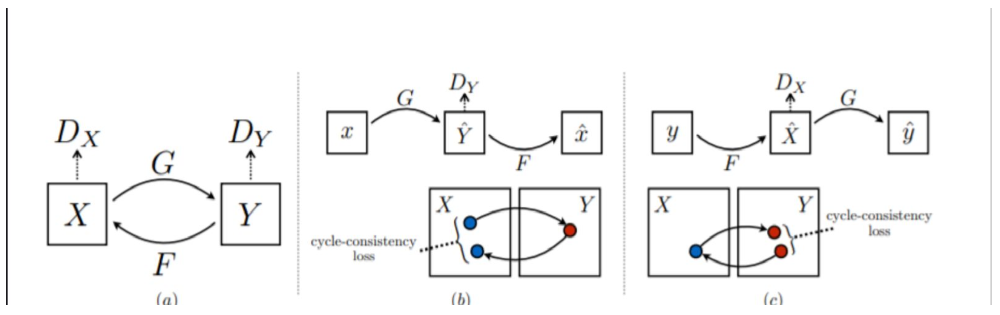

# Brain Image Augmentation using Generative Adversarial Networks (GANs)

Our major objective was to use GANs to create novel images of a brain in a certain domain using the images of the same brain from other domain. In order to perform this style transfer, we used 2 different models:
1. CycleGAN
2. CollaGAN

We will discuss the two in detail now. The code for both are present in the repo.

## CycleGAN: 
Personal blog link: https://medium.com/@16bit108/cyclegan-brain-image-augmentation-8449f8911f0f

In CycleGAN, there are two generators and two discriminators. Considering Generators as G and F and discriminators $`D_X`$ and $`D_Y`$, they are all used to perform style transfer between two domains X and Y. Here, X is a stack of images from type T1, T1-Ce, and T2. And Y will have a single image from FLAIR. X and Y will be given as input to G and F to produce reconstructed images Y' and X' respectively. X' and Y' will be passed on to $`D_X`$ and $`D_Y`$ along with real images X and Y to train the discriminators using LSloss. Then using X' and Y', G and F will reproduce Y" and X". These will be compared with X and Y (real images) using SSIM loss and L1loss which is called as cyclic consistency loss. In this way, generator is trained. The remaining specifications are provided below.

The generator uses CCNR modules. A CCNR module is comprised of two parallel conv blocks of 1x1 and 3x3 kernels. Using padding, they are then concatenated.

## Losses:

### Generators:
The Generators reduce cycle loss and adversarial loss. The cycle loss is as follows:

  $`cycle\_loss=2*L1(X,X'')+2*L1(Y,Y'')+SSIM(Y,Y'')+SSIM(X,X'')+2(2*L1(X,X')+2*L1(Y,Y')+SSIM(Y,Y')+SSIM(X,X'))`$

  $`adversarial\_loss\_1=LSLoss(D_X(X'),1)`$ (For Generator G)
  
  $`adversarial\_loss\_2=LSLoss(D_Y(Y'),1)`$ (For Generator F)

### Discriminators:
The Discriminators decrease the adversarial loss only.

  (For Discriminator DX)
  $`adversarial\_loss\_1=LSLoss(D_X(X),1)+LSLoss(D_X(X'),0))`$
  
  (For Discriminator DY)
  $`adversarial\_loss\_2=LSLoss(D_Y(Y),1)+LSLoss(D_Y(Y'),0)`$ 

The hyperparameters are specified below:
1. Batch Size = 20
2. Learning Rates:
   1. Generator G: $`10^{-3}`$
   2. Generator F: $`0.5 * 10^{-3}`$
   3. Discriminators: $`10^{-6}`$
3. Number of updates for both networks: 1 per epoch
4. Weights of cycle loss (lambda1 and lambda2): 0.3
5. Ratio of SSIM loss to L1 loss in cycle loss: 1:2
6. Ratio of construction to reconstruction loss (i.e. cycleloss(X’) : cycleloss(X”)): 2:1

## CollaGAN

This Figure shows the architecture used for the Generator of CollaGAN

All inputs have their own encoding branches for which Input here is of shape (5,240,240) using channel first as we used pytorch 1 for inputs a,b,c,d and 4 for mask which is one hot encoded in channel so only one channel has 1 and others have 0 signifying the missing data.

Then we have 4 CCNL and Max Pool combination layers. CCNL has two conv layers with 1x1 and 3x3 filter size and 3x3 layers has padding to maintain size as they get concated ahead. Then go through Instance Normalization layer. Then comes the activation layer of Leaky ReLU with leak of 0.01.

Then comes decoding branch which takes concated input from each of the encoding branch. Decoding branch has 4 CCNL, CCAM and ConvTranspose combination. CCAM is used to influence the output of CCNL with the mask vector, here mask vector will be 1d or vector with 4 values one hot encoded unlike start where mask is full image.As for CCAM first the average is taken over dim or axis (2,3) so giving 1d or vector output of (batch_size,channel) shape and this is concated with 1d mask vector of (batch_size,4) shape This goes through MLP of 3 Fully Connected layers with LeakyReLU,LeakyReLU,Sigmoid as activations and final output layers has same neurons as channel of input, then the input is multiplied with this output channel wise influencing mask into the input. Then ConvTranspose is used for learned up-sampling.

Then a final CCNL layer is added to final process the imputed image.

As for Discriminator input is (1,240,240) shape and is processed in 3 paths all giving the same number of channels in the output. Path 1 is 4 Conv Layers,Path 2 is 2 Conv+Maxpooling and then Conv+Leaky ReLU, Path 3 is 4 Conv Layers with LeakyReLU as activation on 2nd and 3rd layer. Then concating the outputs of all Path they go through merge section where all individually process information is merged with 2 Conv+Leaky ReLU layers. Then further branches are created 1 for prediction real or fake(rf branch) and one for predicting which class(classify branch). Rf branch has 2 Conv2d and final activation is Sigmoid for getting probability of real and fake. Classify branch is the same just with different channel in output and with softmax activation over channel for classifying into which class the input belongs.

Pipeline of CollaGAN is choosing random type and removing it for each batch, creating appropriate mask, concating mask to images and then giving them to generator to get reconstructed(recon) image. Discriminator then takes real and fake image and gives 2 output for each. Then using recon and other 3, we create 4 new recons by removing one type and using others to generate it again with 4 masks. All of the pass through discriminator and give 2 output each.

## Losses:
1. Least Squared Loss:
   $`L^{dsc}_{gan}(D_{gan})=E_{x_K}[(D_{gan}(x_K)-1)^2] + E_{\hat{x}_{K|K}}[(D_{gan}(\hat{x}_{K|K}))^2]`$
   $`L^{gen}_{gan}(G) = E_{\hat{x}_{K|K}}[(D_{gan}(\hat{x}_{K|K}-1))^2]`$
2. Categorical Cross Entropy:

   $`L^{real}_{clsf}(D_{clsf}) = E_{x_K}[-log(D_{clsf}(K;x_K))]`$
3. L1 and L2 distance loss:

   $`L_{mcc,a} = \|x_b - \bar{x}_{b|a}\|_1 + \|x_c - \bar{x}_{c|a}\|_1 + \|x_d - \bar{x}_{d|a}\|_1`$
5. SSIM loss:

   $`SSIM(p) = \frac{2\mu_X\mu_Y+C_1}{\mu_X^2+\mu_Y^2+C_1}*\frac{\sigma{XY} + C_2}{\sigma_X^2+\sigma_Y^2+C_2}`$

We used https://github.com/Po-Hsun-Su/pytorch-ssim library to which has inbuilt ssim loss function for maximizing loss as 1 being max value gives best result and we used second formula to changed it minimizing loss would give better result. 

Generator minimizes
L2 distance between recon, 4 new cyclic recons with target, 4 inputs respectively
So 5 L2 loss
L1 distance between recon, 4 new cyclic recons with target, 4 inputs respectively
So 5 L1 loss
SSIM between recon, 4 new cyclic recons with target, 4 inputs respectively
So 5 SSIM

Least squared loss which takes 5 recons’ rf and target values which are real for Gen as it wants to fool discriminator.

Categorical Cross Entropy which takes 5 recons’ class value and target value being class for that recon.

So these 25 loss added up to final generator loss but,

All these have 7 hyper parameters attached which decides the contribution of these losses to the overall loss.

Discriminator minimizes:
Categorical Cross entropy loss for class of original 4 inputs with corresponding targets. Least sqaured Loss for all real images and fake recons.

So 4 cce loss + 10 ls loss add up to final loss.
